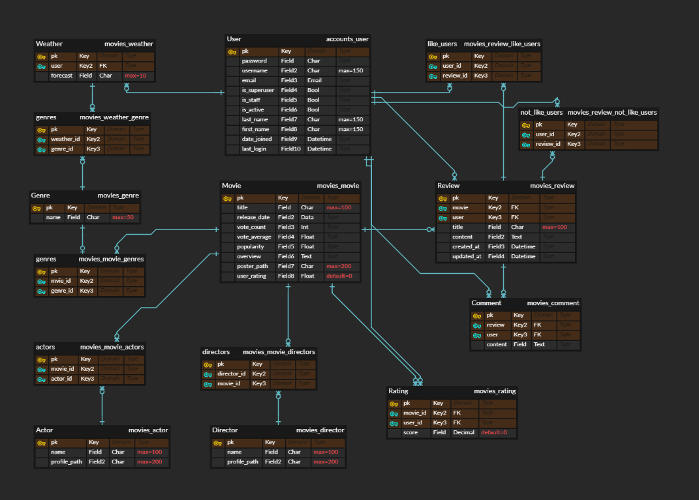
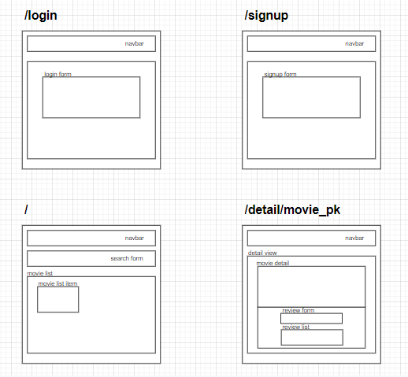
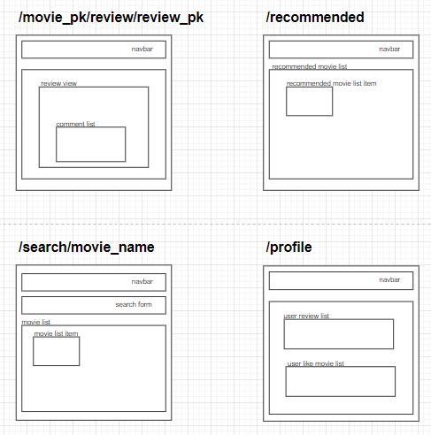
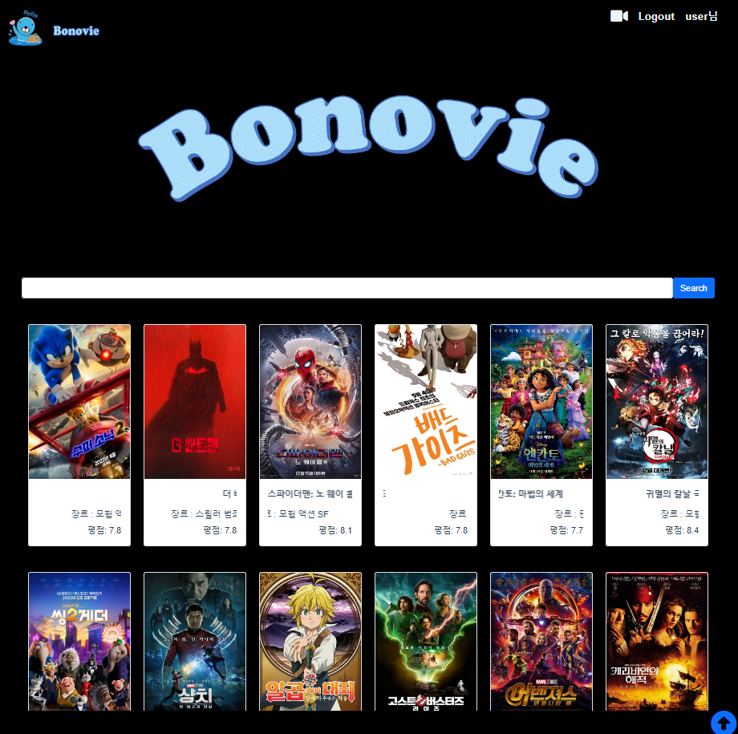
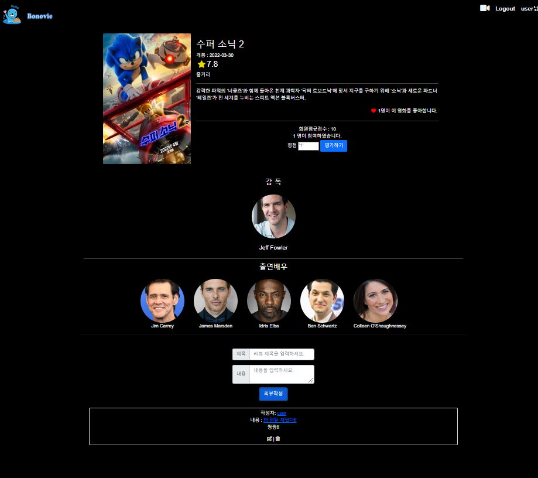
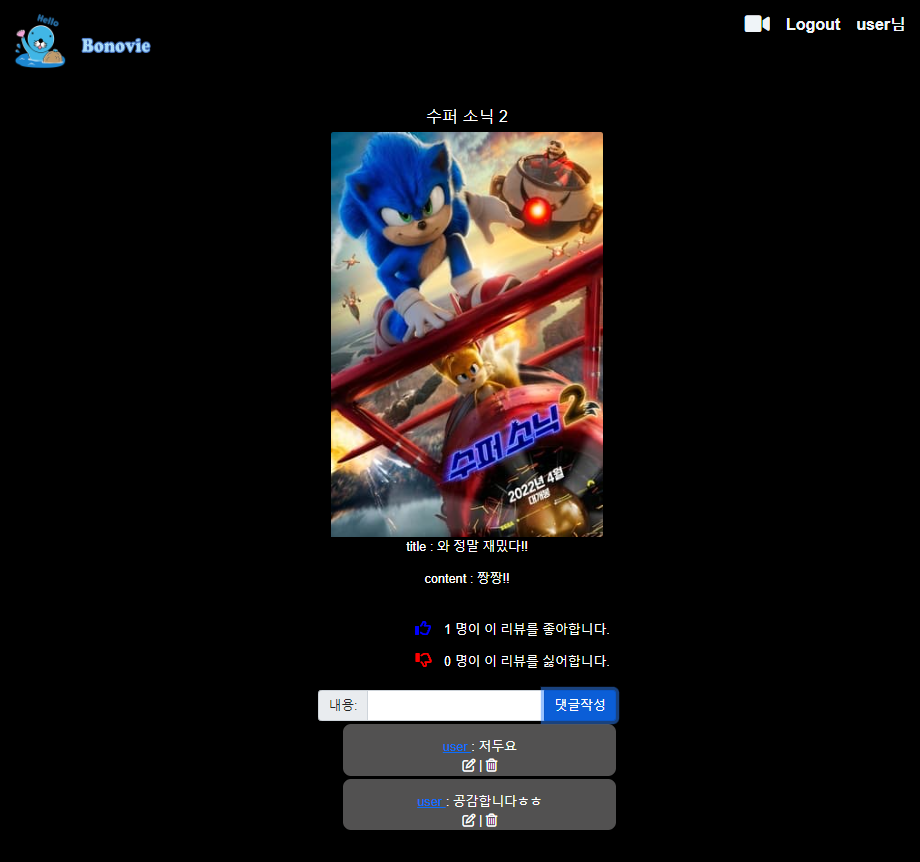
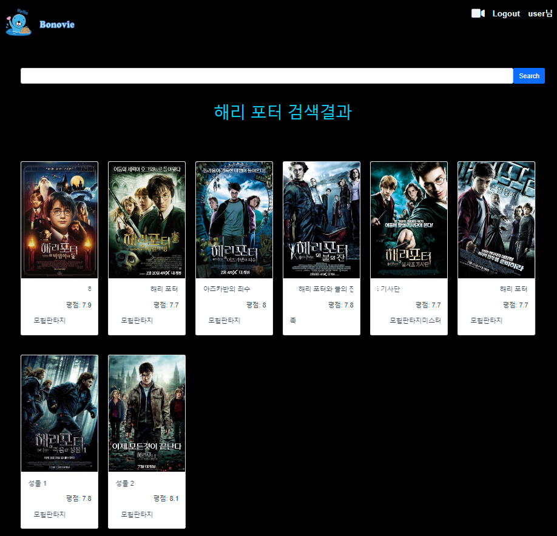
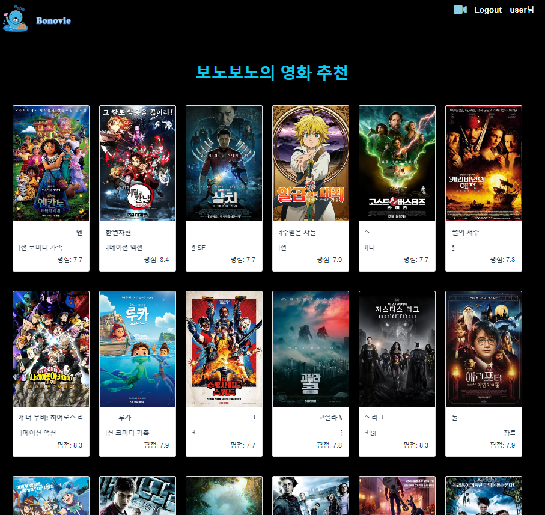

### 목차

[시작하기](#시작하기)

[**1. 팀원 정보 및 업무 분담 내역**](#1-팀원-정보-및-업무-분담-내역)

[**2. 목표 서비스 구현 및 실제 구현 정도**](#2-목표-서비스-구현-및-실제-구현-정도)

[**3. 데이터베이스 모델링 (ERD) & 컴포넌트 구성**](#3-데이터베이스-모델링-erd--컴포넌트-구성)

* [3-1. ERD](#3-1-erd)
* [3-2. Components](#3-2-components)

[**4. 필수 기능에 대한 설명**](#4-필수-기능에-대한-설명)

* [4-1. 영화 목록](#4-1-영화-목록)
* [4-2. 추천](#4-2-추천)
* [4-3. 커뮤니티](#4-3-커뮤니티)
* [4-4. 검색](#4-4-검색)
* [4-5. 프로필](#4-5-프로필)

[**5. 상세페이지**](#5-상세페이지)

* [5-1. 메인페이지](#5-1-메인페이지)
* [5-2. 영화 상세페이지 및 리뷰 작성](#5-2-영화-상세페이지-및-리뷰-작성)
* [5-3. 리뷰 상세 페이지 및 댓글](#5-3-리뷰-상세-페이지-및-댓글)
* [5-4. 검색 결과 페이지](#5-4-검색-결과-페이지)
* [5.5 영화 추천 페이지](#5-5-영화-추천-페이지)

[**6. 느낀 점**](#6-느낀-점)


## **시작하기**

1. django

   - 가상환경 구축

     ```bash
     $ python -m venv venv
     
     $ source venv/Scripts/activate
     ```

   - 패키지 설치

     ```bash
     $ pip install -r requirements.txt
     ```

   - migrate 후 데이터 로드

     ```bash
     $ python manage.py migrate
     
     $ python manage.py loaddata movies/movies.json movies/actors.json movies/directors.json movies/genres.json
     ```

   - 서버 실행

     ```bash
     $ python manage.py runserver
     ```

     

2.  vue

   - 패키지 설치 후 서버 실행

     ```bash
     $ npm install
     
     $ npm run serve
     ```

     


## **1. 팀원 정보 및 업무 분담 내역**

| 팀원   | 업무 내용                                                    |
| ------ | ------------------------------------------------------------ |
| 팀원1 | Front-end : 메인, 추천, 검색 페이지 구현, CSS 및 Bootstrap   |
| 팀원2 | Front-end : 디테일 페이지 구현(리뷰, 댓글, 평점), CSS 및 Bootstrap |
| 조유진 | Back-end : Django 모델링, 데이터 수집(TMDB API), 추천 알고리즘 |


## **2. 목표 서비스 구현 및 실제 구현 정도**

| 목표                                                         | 실제 구현                                                    |
| ------------------------------------------------------------ | ------------------------------------------------------------ |
| Accounts<br /><br />관리자 페이지 (영화, 유저 관리) <br />유저 로그인, 로그아웃 <br />유저 회원가입, 회원탈퇴 <br />소셜 로그인 | Accounts<br /><br />관리자 페이지 (영화, 유저 관리) <br />유저 로그인, 로그아웃 <br />유저 회원가입, 회원탈퇴 <br /> |
| DB & API <br /><br />영화 데이터 크롤링(TMDB API) <br />데이터 모델링 영화 예고편 (Youtube API) <br />영화에 대한 유저 평점 <br />유저 평점 기반 추천 알고리즘 | DB & API <br /><br />영화 데이터 크롤링(TMDB API) <br />데이터 모델링 영화 예고편 (Youtube API) <br />영화에 대한 유저 평점 <br />유저 평점 기반 추천 알고리즘 |
| Community <br /><br />영화 리뷰 작성, 수정, 삭제 <br />리뷰 댓글 작성, 수정, 삭제 <br />리뷰 좋아요, 싫어요 기능 | Community <br /><br />영화 리뷰 작성, 수정, 삭제 <br />리뷰 댓글 작성, 수정, 삭제 <br />리뷰 좋아요, 싫어요 기능 |
| Web <br /><br />메인 페이지에 영화 리스트 <br />영화 클릭시 디테일 페이지로 이동 <br />영화 제목, 배우, 감독으로 검색 기능 <br />영화 추천 페이지 <br />유저 프로필 페이지 | Web <br /><br />메인 페이지에 영화 리스트 <br />영화 클릭시 디테일 페이지로 이동 <br />영화 제목으로 검색 기능 <br />영화 추천 페이지 <br />유저 프로필 페이지 |


## **3. 데이터베이스 모델링 (ERD) & 컴포넌트 구성**

### 3-1. ERD




### 3-2. Components






## **4. 필수 기능에 대한 설명**

### 4-1. 영화 목록

- `popularity` 순으로 정렬한 전체 영화를 페이지에 렌더링

- 페이지 아래 버튼을 생성해 한 번에 렌더링 되는 영화의 수를 조절

- 각각의 영화를 클릭 시 영화의 상세 페이지로 이동

  - 영화에 대한 좋아요와 평점

  

### 4-2. 추천

- 유저가 좋아요한 영화가 존재할 경우 해당 영화들의 장르를 기반으로 추천

  - 유저가 좋아요한 영화의 장르들 중 가장 빈도수가 높은 장르를 채택해서 추천

- 유저가 좋아요한 영화가 존재하지 않을 경우 오늘 날씨 기반 추천

  - [기상청 API](https://www.data.go.kr/data/15084084/openapi.do)를 활용하여 유저의 날씨 정보를 파악하고 날씨를 6가지로 분류
  - 분류한 날씨에 따른 장르를 설정해두고 해당 장르 기반 추천

  

### 4-3. 커뮤니티

- 영화의 상세 페이지에서 해당 영화에 대한 리뷰 작성, 수정, 삭제 가능

- 리뷰 클릭 시 리뷰의 상세 페이지로 이동

  - 리뷰에 대한 좋아요와 싫어요 표시
  - 리뷰에 대한 댓글 작성, 수정, 삭제

  

### 4-4. 검색

- 메인 페이지에서 검색 시 해당 단어가 포함된 영화 출력
- 검색 페이지에서 영화 클릭 시 해당 영화의 상세 페이지로 이동


### 4-5. 프로필

- 유저의 프로필 페이지에서 유저가 작성한 리뷰와 좋아요한 영화 조회 가능
- 회원 탈퇴 버튼 클릭 시 회원 탈퇴

 

##  **5. 상세페이지**

### 5-1. 메인페이지




### 5-2. 영화 상세페이지 및 리뷰 작성




### 5-3. 리뷰 상세 페이지 및 댓글




### 5-4. 검색 결과 페이지




### 5-5 영화 추천 페이지



## 6. 느낀 점

-  처음 프로젝트를 진행하다보니 미흡한 부분들이 많이 있었다. 우선 기본적인 기능 구현에 초점을 맞춰 진행했는데 기획 단계에서 꼼꼼히 기획하지 못했던 것이 후반부의 스타일링 작업과 백엔드와 프론트엔드 간의 데이터 교환에 있어서 어려움이 많았다. 
- 팀 프로젝트이다 보니 혼자서 진행했을 때와는 달리 모든 코드를 알고 있지 못하기 때문에 프론트엔드에서는 어떤 작업을 진행하고 있고 또 어떤 코드들을 작성하고 있는지 자주 확인해야 한다는 점을 간과했던 것이 아쉽다. 
- 기본 기능에만 집중하다보니 우리 사이트만의 특별한 기능을 추가하지 못했던 것도 아쉬움이 남는다. 
- 다음 프로젝트에서는 우리 팀만의 특색있는 서비스를 구현해보고 싶다. 또한 이번에 느꼈던 아쉬운 점들을 개선해서 다음에는 기획 단계부터 꼼꼼히 프로젝트를 진행해나가고 싶다. 
